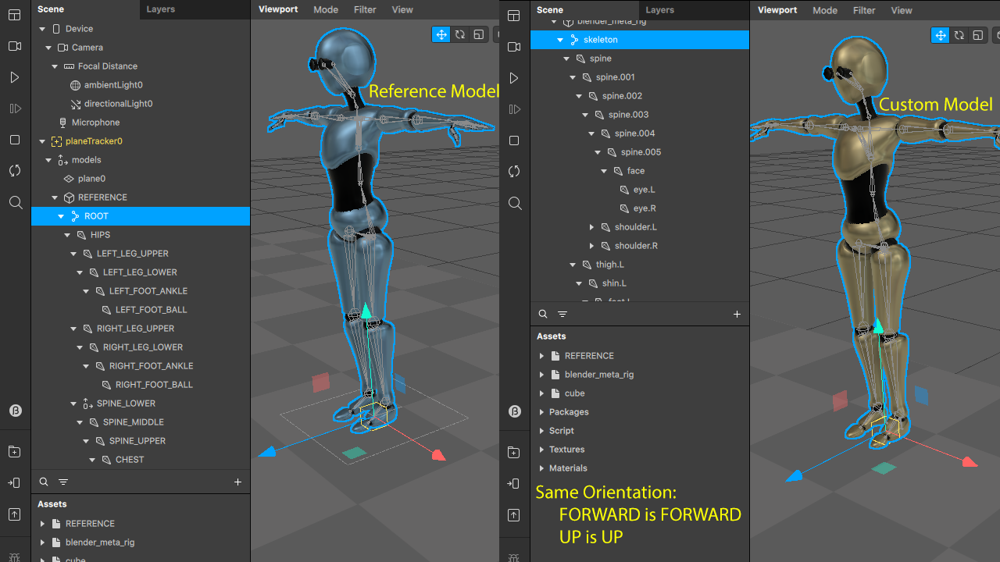
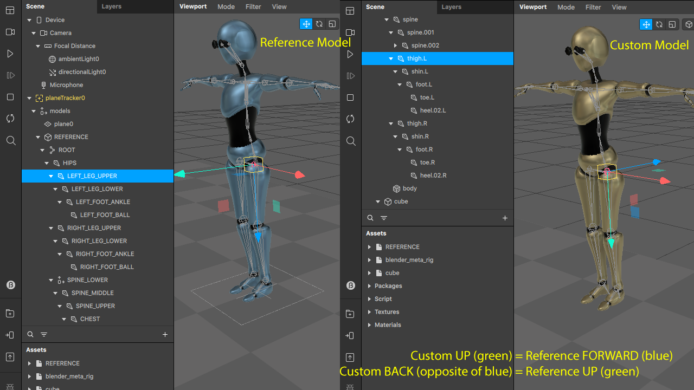
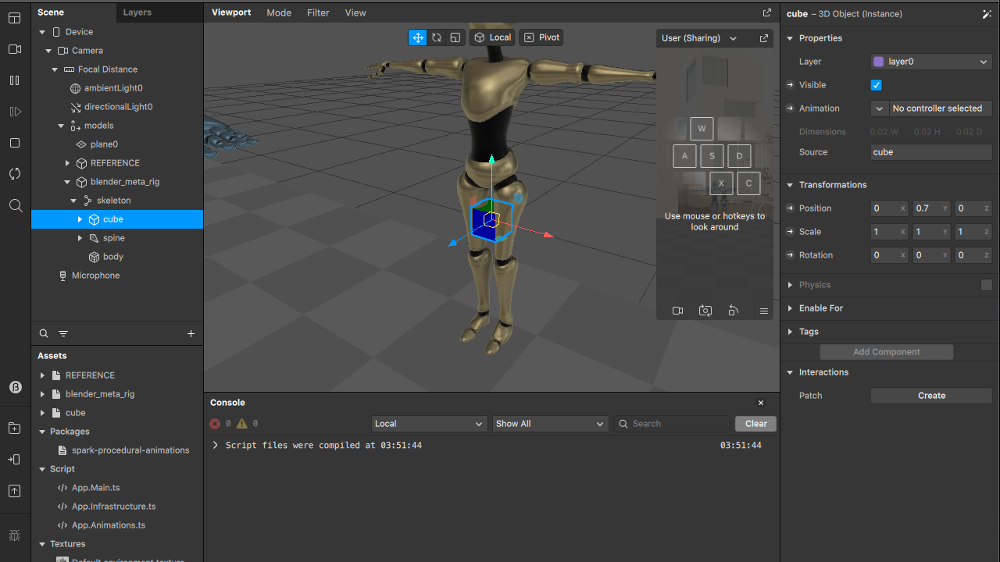

# Humanoid Character Model Configuration

### Introduction

We want to be able to execute the same procedural animations on models with different rigs. To achieve that we will add specific configuration for each rig we use. In this tutorial we learn how to create character configuration from scratch.

You can open the [initial state of the tutorial template](./projects/START_character-configuration.arprojpkg).
You will find there two models. The `blue robot` named `REFERENCE` represents so called identity model, where all the bones are named the way expected by `Spark procedural animations` library and all joint orientations are the assumed one. The `golder robot` named `blender_meta_rig` (because it uses blender meta rig) and this is the one we will use to demonstrate how to write configuration by comparing it to the reference model to find:
 * matching joint names
 * joint orientations

> NOTE: you can find [completed tutorial here](./projects/END_character-configuration.arprojpkg).

### Scene Description

The setup of the scene can be found in `scripts/Main.ts` script. There we invoke `startProceduralAnimations` function requesting to have `MainController` as starting behavior and model named `REFERENCE` with configuration `IdentityConfig`. Then inside the `MainController.initialize()` method we create new `CharacterController` for each of the characters defined. Inside this controller we describe what should the character do:

```ts
private startWalkCycle(): void {
  // 1. start idle animation
  this.holder
      .playAnimation(IdleAnimation)
      .setCharacter(this.human)
  ;

  this.holder
      // 2. wait 1,2,3 or 5 seconds (fibonacci sequence)
      .waitFor(rndOf4(1,2,3,5))
      .then(() => {
        // 3. then walk
        const walk =
          this.holder
              .playAnimation(WalkAnimation)
              .setCharacter(this.human);

        // define sequence of points to walk to (taken from the global walkPaths variable)
        for(const p of this.points) {
          walk.addTarget(p);
        }
      })
      ;
}
```

If you play the start state of the tutorial you will see that the blue robot (`REFERENCE` one) walks following predefined path, then stops, then walks again.

Our goal is to configure the other `golder` robot who has completely different rig so we can reuse the same animations.

### Identity Rig

In `scripts/App.Infrastructure.ts` script file you will find class called `IdentityConfig` that implements interface `ICharacterConfig`. This is the configuration that we can use for the `REFERENCE` `blue robot`. If you look inside that class you will see that we define orientations of the joins in `_jointsData` map and the mapping of joints names in `_jointsMap`.

You will notice that orientation for all the joints in `IdentityConfig` is the same:

```ts
[j.JOINT_NAME]: new JointData(j.JOINT_NAME, V3.fw, V3.up, lookAt_fw_up),
```

>  NOTE: in Spark **red** arrow is `left`, **green** arrow is `up`, and **blue** arrow is `forward`, the opposite of `left` is `right`, the opposite of `up` is `down` , and the opposite of `forward` is `back`. Left: `lt`, right: `rt`, forward: `fw`, back: `bk`, down: `dn`.

`JointData` parameters:
 1. name of the joint (type: `string`)
 2. forward direction (type: `IV3Readonly`)
 3. up direction (type: `IV3Readonly`)
 4. function that matches given forward and up directions (type: `ILookAtFunc`)

You can read that: for joint with name `JOINT_NAME` assume the visible forward (`fw`) direction to be the desired forward direction and the visible up direction to be the desired up. In this case visible and desired are the same.

In `IdentityConfig` forward is always forward and up is always up, meaning all joints point as we assume the REFERENCE rig to be. That means we can use that model to compare it with any other humanoid model we want to configure.

We see 2 type of joint orientation:
 1. Joints used in inverse kinematics chains. (Arm joints, leg joints, spine joints. )
    > Forward direction points to the next joint in the chain.  We never have to control them directly except when writing inverse kinematics solvers.
 2. Joints used controlled directly without inverse kinematics chain. (Hips, Neck, Head, Shoulders)
    > Forward direction points to the forward direction of the model.

Next we can see that for the joints map in `IdentityConfig` we have:

```ts
...
[j.HIPS]: j.HIPS,
[j.SPINE_LOWER]: j.SPINE_LOWER,
[j.SPINE_MIDDLE]: j.SPINE_MIDDLE,
...
```
That means all joints are named as the ideal names assume. If for example instead of `HIPS` joint you have `Pelvis` in your model, then you would configure that as:
```ts
[j.HIPS]: 'Pelvis',
```

## Writing Custom Configuration

Now let's copy and paste `IdentityConfig` class and rename the copy as as `BlenderMetaRigConfig` (or any other name you like). Then we can find matching joint for each of the joints of the `REFERENCE` model. The result would be:

```ts
this._jointsMap = {
    [j.ROOT]: 'skeleton',
    [j.HIPS]: 'spine',
    //[j.SPINE_LOWER]: "",
    [j.SPINE_MIDDLE]: 'spine.001',
    [j.SPINE_UPPER]: 'spine.002',
    [j.CHEST]: 'spine.003',
    [j.RIGHT_SHOULDER]: 'shoulder.R',
    [j.RIGHT_ARM_UPPER]: 'upper_arm.R',
    [j.RIGHT_ARM_LOWER]: 'forearm.R',
    [j.RIGHT_HAND_WRIST]: 'hand.R',
    //[j.RIGHT_HAND_THUMB_TRAPEZIUM]: "",
    [j.RIGHT_HAND_THUMB_META]: 'thumb.01.R',
    [j.RIGHT_HAND_THUMB_PROXIMAL]: 'thumb.02.R',
    [j.RIGHT_HAND_THUMB_DISTAL]: 'thumb.03.R',
    //[j.RIGHT_HAND_RING_META]: "",
    [j.RIGHT_HAND_RING_PROXIMAL]: 'f_ring.01.R',
    [j.RIGHT_HAND_RING_INTERMEDIATE]: 'f_ring.02.R',
    [j.RIGHT_HAND_RING_DISTAL]: 'f_ring.03.R',
    //[j.RIGHT_HAND_PINKY_META]: "",
    [j.RIGHT_HAND_PINKY_PROXIMAL]: 'f_pinky.01.R',
    [j.RIGHT_HAND_PINKY_INTERMEDIATE]: 'f_pinky.02.R',
    [j.RIGHT_HAND_PINKY_DISTAL]: 'f_pinky.03.R',
    //[j.RIGHT_HAND_MIDDLE_META]: "",
    [j.RIGHT_HAND_MIDDLE_PROXIMAL]: 'f_middle.01.R',
    [j.RIGHT_HAND_MIDDLE_INTERMEDIATE]: 'f_middle.02.R',
    [j.RIGHT_HAND_MIDDLE_DISTAL]: 'f_middle.03.R',
    //[j.RIGHT_HAND_INDEX_META]: "",
    [j.RIGHT_HAND_INDEX_PROXIMAL]: 'f_index.01.R',
    [j.RIGHT_HAND_INDEX_INTERMEDIATE]: 'f_index.02.R',
    [j.RIGHT_HAND_INDEX_DISTAL]: 'f_index.03.R',
    [j.NECK]: 'spine.004',
    [j.HEAD]: 'spine.005',
    // [j.JAW]: "",
    // [j.LEFT_EYE]: "",
    // [j.RIGHT_EYE]: "",
    [j.LEFT_SHOULDER]: 'shoulder.L',
    [j.LEFT_ARM_UPPER]: 'upper_arm.L',
    [j.LEFT_ARM_LOWER]: 'forearm.L',
    [j.LEFT_HAND_WRIST]: 'hand.L',
    //[j.LEFT_HAND_THUMB_TRAPEZIUM]: "",
    [j.LEFT_HAND_THUMB_META]: 'thumb.01.L',
    [j.LEFT_HAND_THUMB_PROXIMAL]: 'thumb.02.L',
    [j.LEFT_HAND_THUMB_DISTAL]: 'thumb.03.L',
    //[j.LEFT_HAND_RING_META]: "",
    [j.LEFT_HAND_RING_PROXIMAL]: 'f_ring.01.L',
    [j.LEFT_HAND_RING_INTERMEDIATE]: 'f_ring.02.L',
    [j.LEFT_HAND_RING_DISTAL]: 'f_ring.03.L',
    //[j.LEFT_HAND_PINKY_META]: "",
    [j.LEFT_HAND_PINKY_PROXIMAL]: 'f_pinky.01.L',
    [j.LEFT_HAND_PINKY_INTERMEDIATE]: 'f_pinky.02.L',
    [j.LEFT_HAND_PINKY_DISTAL]: 'f_pinky.03.L',
    //[j.LEFT_HAND_MIDDLE_META]: "",
    [j.LEFT_HAND_MIDDLE_PROXIMAL]: 'f_middle.01.L',
    [j.LEFT_HAND_MIDDLE_INTERMEDIATE]: 'f_middle.02.L',
    [j.LEFT_HAND_MIDDLE_DISTAL]: 'f_middle.03.L',
    //[j.LEFT_HAND_INDEX_META]: "",
    [j.LEFT_HAND_INDEX_PROXIMAL]: 'f_index.01.L',
    [j.LEFT_HAND_INDEX_INTERMEDIATE]: 'f_index.02.L',
    [j.LEFT_HAND_INDEX_DISTAL]: 'f_index.03.L',
    [j.RIGHT_LEG_UPPER]: 'thigh.R',
    [j.RIGHT_LEG_LOWER]: 'shin.R',
    [j.RIGHT_FOOT_ANKLE]: 'foot.R',
    [j.RIGHT_FOOT_BALL]: 'toe.R',
    [j.LEFT_LEG_UPPER]: 'thigh.L',
    [j.LEFT_LEG_LOWER]: 'shin.L',
    [j.LEFT_FOOT_ANKLE]: 'foot.L',
    [j.LEFT_FOOT_BALL]: 'toe.L',
    };
```
> NOTE: that some of the reference joints (like `SPINE_LOWER`) don't have any matches. For those we are allowed to omit them. Not all joints are allowed to be omitted but those that are not critical for the motion can be omitted safely. Those would be the header joints, _META hand joints, SPINE_LOWER and the head joints.

Now we have to compare the orientation of each matching joint to the orientation of our `REFERENCE` model. For example for for HIPS we have
```ts
[j.SKELETON]: new JointData(j.SKELETON, V3.fw, V3.up, lookAt_fw_up)
```
Meaning that forward is forward and up is up - or the joint is oriented as in the `REFERENCE` model.

 

On the other hand for `LEFT_LEG_UPPER` we see:
```ts
[j.LEFT_LEG_UPPER]: new JointData(j.LEFT_LEG_UPPER, V3.up, V3.bk, lookAt_up_bk)
```
Meaning, that what in our model is `up` we will assume to be `forward` (first parameter) and what in our model is `back` we will assume to be `up` (second parameter).

 

Our configuration class so far should look like that:

```ts
export class BlenderMetaRigConfig implements ICharacterConfig {
  private readonly _jointsData: {[key: string]: JointData};
  private readonly _jointsMap: {[key: string]: string};
  private readonly _reverseJointsMap: {[key: string]: string};
  constructor() {
    const j = JointType;
    this._jointsData = {
      [j.MODEL]: new JointData(j.MODEL, V3.fw, V3.up, lookAt_fw_up),
      [j.ROOT]: new JointData(j.ROOT, V3.fw, V3.up, lookAt_fw_up),
      [j.SKELETON]: new JointData(j.ROOT, V3.fw, V3.up, lookAt_fw_up),
      [j.HIPS]: new JointData(j.HIPS, V3.fw, V3.up, lookAt_fw_up),
      [j.SPINE_LOWER]: new JointData(j.SPINE_LOWER, V3.fw, V3.up, lookAt_fw_up),
      [j.SPINE_MIDDLE]: new JointData(j.SPINE_MIDDLE, V3.up, V3.bk, lookAt_up_bk),
      [j.SPINE_UPPER]: new JointData(j.SPINE_UPPER, V3.up, V3.bk, lookAt_up_bk),
      [j.CHEST]: new JointData(j.CHEST, V3.fw, V3.up, lookAt_fw_up),
      [j.RIGHT_SHOULDER]: new JointData(j.RIGHT_SHOULDER,V3.rt,V3.fw,lookAt_rt_fw),
      [j.RIGHT_ARM_UPPER]: new JointData(j.RIGHT_ARM_UPPER, V3.up, V3.lt, lookAt_up_lt),
      [j.RIGHT_ARM_LOWER]: new JointData(j.RIGHT_ARM_LOWER, V3.up, V3.lt, lookAt_up_lt),
      [j.RIGHT_HAND_WRIST]: new JointData(j.RIGHT_HAND_WRIST, V3.up, V3.lt, lookAt_up_lt),
      //[j.RIGHT_HAND_THUMB_TRAPEZIUM]: ...),
      [j.RIGHT_HAND_THUMB_META]: new JointData(j.RIGHT_HAND_THUMB_META, V3.up, V3.bk, lookAt_up_bk),
      [j.RIGHT_HAND_THUMB_PROXIMAL]: new JointData(j.RIGHT_HAND_THUMB_PROXIMAL,V3.up, V3.bk, lookAt_up_bk),
      [j.RIGHT_HAND_THUMB_DISTAL]: new JointData(j.RIGHT_HAND_THUMB_DISTAL,V3.up, V3.bk, lookAt_up_bk),
      //[j.RIGHT_HAND_RING_META]: ...),
      [j.RIGHT_HAND_RING_PROXIMAL]: new JointData(j.RIGHT_HAND_RING_PROXIMAL,V3.up, V3.bk, lookAt_up_bk),
      [j.RIGHT_HAND_RING_INTERMEDIATE]: new JointData(j.RIGHT_HAND_RING_INTERMEDIATE,V3.up, V3.bk, lookAt_up_bk),
      [j.RIGHT_HAND_RING_DISTAL]: new JointData(j.RIGHT_HAND_RING_DISTAL,V3.up, V3.bk, lookAt_up_bk),
      //[j.RIGHT_HAND_PINKY_META]: ...),
      [j.RIGHT_HAND_PINKY_PROXIMAL]: new JointData(j.RIGHT_HAND_PINKY_PROXIMAL, V3.up, V3.bk, lookAt_up_bk),
      [j.RIGHT_HAND_PINKY_INTERMEDIATE]: new JointData(j.RIGHT_HAND_PINKY_INTERMEDIATE, V3.up, V3.bk, lookAt_up_bk),
      [j.RIGHT_HAND_PINKY_DISTAL]: new JointData(j.RIGHT_HAND_PINKY_DISTAL, V3.up, V3.bk, lookAt_up_bk),
      //[j.RIGHT_HAND_MIDDLE_META]: ...),
      [j.RIGHT_HAND_MIDDLE_PROXIMAL]: new JointData(j.RIGHT_HAND_MIDDLE_PROXIMAL, V3.up, V3.bk, lookAt_up_bk),
      [j.RIGHT_HAND_MIDDLE_INTERMEDIATE]: new JointData(j.RIGHT_HAND_MIDDLE_INTERMEDIATE, V3.up, V3.bk, lookAt_up_bk),
      [j.RIGHT_HAND_MIDDLE_DISTAL]: new JointData(j.RIGHT_HAND_MIDDLE_DISTAL, V3.up, V3.bk, lookAt_up_bk),
      //[j.RIGHT_HAND_INDEX_META]: ...),
      [j.RIGHT_HAND_INDEX_PROXIMAL]: new JointData(j.RIGHT_HAND_INDEX_PROXIMAL, V3.up, V3.bk, lookAt_up_bk),
      [j.RIGHT_HAND_INDEX_INTERMEDIATE]: new JointData(j.RIGHT_HAND_INDEX_INTERMEDIATE, V3.up, V3.bk, lookAt_up_bk),
      [j.RIGHT_HAND_INDEX_DISTAL]: new JointData(j.RIGHT_HAND_INDEX_DISTAL, V3.up, V3.bk, lookAt_up_bk),
      [j.NECK]: new JointData(j.NECK, V3.fw, V3.up, lookAt_fw_up),
      [j.HEAD]: new JointData(j.HEAD, V3.fw, V3.up, lookAt_fw_up),
      //[j.JAW]: ...),
      [j.LEFT_EYE]: new JointData(j.LEFT_EYE, V3.up, V3.fw, lookAt_up_fw),
      [j.RIGHT_EYE]: new JointData(j.RIGHT_EYE, V3.up, V3.fw, lookAt_up_fw),
      [j.LEFT_SHOULDER]: new JointData(j.LEFT_SHOULDER, V3.lt, V3.fw, lookAt_lt_fw),
      [j.LEFT_ARM_UPPER]: new JointData(j.LEFT_ARM_UPPER, V3.up, V3.rt, lookAt_up_rt),
      [j.LEFT_ARM_LOWER]: new JointData(j.LEFT_ARM_LOWER, V3.up, V3.rt, lookAt_up_rt),
      [j.LEFT_HAND_WRIST]: new JointData(j.LEFT_HAND_WRIST, V3.up, V3.rt, lookAt_up_rt),
      //[j.LEFT_HAND_THUMB_TRAPEZIUM]: ...),
      [j.LEFT_HAND_THUMB_META]: new JointData(j.LEFT_HAND_THUMB_META, V3.up, V3.bk, lookAt_up_bk),
      [j.LEFT_HAND_THUMB_PROXIMAL]: new JointData(j.LEFT_HAND_THUMB_PROXIMAL, V3.up, V3.bk, lookAt_up_bk),
      [j.LEFT_HAND_THUMB_DISTAL]: new JointData(j.LEFT_HAND_THUMB_DISTAL, V3.up, V3.bk, lookAt_up_bk),
      //[j.LEFT_HAND_RING_META]: ...),
      [j.LEFT_HAND_RING_PROXIMAL]: new JointData(j.LEFT_HAND_RING_PROXIMAL, V3.up, V3.bk, lookAt_up_bk),
      [j.LEFT_HAND_RING_INTERMEDIATE]: new JointData(j.LEFT_HAND_RING_INTERMEDIATE, V3.up, V3.bk, lookAt_up_bk),
      [j.LEFT_HAND_RING_DISTAL]: new JointData(j.LEFT_HAND_RING_DISTAL, V3.up, V3.bk, lookAt_up_bk),
      //[j.LEFT_HAND_PINKY_META]: ...),
      [j.LEFT_HAND_PINKY_PROXIMAL]: new JointData(j.LEFT_HAND_PINKY_PROXIMAL, V3.up, V3.bk, lookAt_up_bk),
      [j.LEFT_HAND_PINKY_INTERMEDIATE]: new JointData(j.LEFT_HAND_PINKY_INTERMEDIATE, V3.up, V3.bk, lookAt_up_bk),
      [j.LEFT_HAND_PINKY_DISTAL]: new JointData(j.LEFT_HAND_PINKY_DISTAL, V3.up, V3.bk, lookAt_up_bk),
      //[j.LEFT_HAND_MIDDLE_META]: ...),
      [j.LEFT_HAND_MIDDLE_PROXIMAL]: new JointData(j.LEFT_HAND_MIDDLE_PROXIMAL, V3.up, V3.bk, lookAt_up_bk),
      [j.LEFT_HAND_MIDDLE_INTERMEDIATE]: new JointData(j.LEFT_HAND_MIDDLE_INTERMEDIATE, V3.up, V3.bk, lookAt_up_bk),
      [j.LEFT_HAND_MIDDLE_DISTAL]: new JointData(j.LEFT_HAND_MIDDLE_DISTAL, V3.up, V3.bk, lookAt_up_bk),
      //[j.LEFT_HAND_INDEX_META]: ...),
      [j.LEFT_HAND_INDEX_PROXIMAL]: new JointData(j.LEFT_HAND_INDEX_PROXIMAL, V3.up, V3.bk, lookAt_up_bk),
      [j.LEFT_HAND_INDEX_INTERMEDIATE]: new JointData(j.LEFT_HAND_INDEX_INTERMEDIATE, V3.up, V3.bk, lookAt_up_bk),
      [j.LEFT_HAND_INDEX_DISTAL]: new JointData(j.LEFT_HAND_INDEX_DISTAL, V3.up, V3.bk, lookAt_up_bk),
      [j.RIGHT_LEG_UPPER]: new JointData(j.RIGHT_LEG_UPPER, V3.up, V3.bk, lookAt_up_bk),
      [j.RIGHT_LEG_LOWER]: new JointData(j.RIGHT_LEG_LOWER, V3.up, V3.bk, lookAt_up_bk),
      [j.RIGHT_FOOT_ANKLE]: new JointData(j.RIGHT_FOOT_ANKLE, V3.up, V3.bk, lookAt_up_bk),
      [j.RIGHT_FOOT_BALL]: new JointData(j.RIGHT_FOOT_BALL, V3.up, V3.fw, lookAt_up_fw),
      [j.LEFT_LEG_UPPER]: new JointData(j.LEFT_LEG_UPPER, V3.up, V3.bk, lookAt_up_bk),
      [j.LEFT_LEG_LOWER]: new JointData(j.LEFT_LEG_LOWER, V3.up, V3.bk, lookAt_up_bk),
      [j.LEFT_FOOT_ANKLE]: new JointData(j.LEFT_FOOT_ANKLE, V3.up, V3.bk, lookAt_up_bk),
      [j.LEFT_FOOT_BALL]: new JointData(j.LEFT_FOOT_BALL, V3.up, V3.fw, lookAt_up_fw),
    };

    this._jointsMap = {
      [j.ROOT]: 'skeleton',
      [j.HIPS]: 'spine',
      //[j.SPINE_LOWER]: "",
      [j.SPINE_MIDDLE]: 'spine.001',
      [j.SPINE_UPPER]: 'spine.002',
      [j.CHEST]: 'spine.003',
      [j.RIGHT_SHOULDER]: 'shoulder.R',
      [j.RIGHT_ARM_UPPER]: 'upper_arm.R',
      [j.RIGHT_ARM_LOWER]: 'forearm.R',
      [j.RIGHT_HAND_WRIST]: 'hand.R',
      //[j.RIGHT_HAND_THUMB_TRAPEZIUM]: "",
      [j.RIGHT_HAND_THUMB_META]: 'thumb.01.R',
      [j.RIGHT_HAND_THUMB_PROXIMAL]: 'thumb.02.R',
      [j.RIGHT_HAND_THUMB_DISTAL]: 'thumb.03.R',
      //[j.RIGHT_HAND_RING_META]: "",
      [j.RIGHT_HAND_RING_PROXIMAL]: 'f_ring.01.R',
      [j.RIGHT_HAND_RING_INTERMEDIATE]: 'f_ring.02.R',
      [j.RIGHT_HAND_RING_DISTAL]: 'f_ring.03.R',
      //[j.RIGHT_HAND_PINKY_META]: "",
      [j.RIGHT_HAND_PINKY_PROXIMAL]: 'f_pinky.01.R',
      [j.RIGHT_HAND_PINKY_INTERMEDIATE]: 'f_pinky.02.R',
      [j.RIGHT_HAND_PINKY_DISTAL]: 'f_pinky.03.R',
      //[j.RIGHT_HAND_MIDDLE_META]: "",
      [j.RIGHT_HAND_MIDDLE_PROXIMAL]: 'f_middle.01.R',
      [j.RIGHT_HAND_MIDDLE_INTERMEDIATE]: 'f_middle.02.R',
      [j.RIGHT_HAND_MIDDLE_DISTAL]: 'f_middle.03.R',
      //[j.RIGHT_HAND_INDEX_META]: "",
      [j.RIGHT_HAND_INDEX_PROXIMAL]: 'f_index.01.R',
      [j.RIGHT_HAND_INDEX_INTERMEDIATE]: 'f_index.02.R',
      [j.RIGHT_HAND_INDEX_DISTAL]: 'f_index.03.R',
      [j.NECK]: 'spine.004',
      [j.HEAD]: 'spine.005',
      // [j.JAW]: "",
      // [j.LEFT_EYE]: "",
      // [j.RIGHT_EYE]: "",
      [j.LEFT_SHOULDER]: 'shoulder.L',
      [j.LEFT_ARM_UPPER]: 'upper_arm.L',
      [j.LEFT_ARM_LOWER]: 'forearm.L',
      [j.LEFT_HAND_WRIST]: 'hand.L',
      //[j.LEFT_HAND_THUMB_TRAPEZIUM]: "",
      [j.LEFT_HAND_THUMB_META]: 'thumb.01.L',
      [j.LEFT_HAND_THUMB_PROXIMAL]: 'thumb.02.L',
      [j.LEFT_HAND_THUMB_DISTAL]: 'thumb.03.L',
      //[j.LEFT_HAND_RING_META]: "",
      [j.LEFT_HAND_RING_PROXIMAL]: 'f_ring.01.L',
      [j.LEFT_HAND_RING_INTERMEDIATE]: 'f_ring.02.L',
      [j.LEFT_HAND_RING_DISTAL]: 'f_ring.03.L',
      //[j.LEFT_HAND_PINKY_META]: "",
      [j.LEFT_HAND_PINKY_PROXIMAL]: 'f_pinky.01.L',
      [j.LEFT_HAND_PINKY_INTERMEDIATE]: 'f_pinky.02.L',
      [j.LEFT_HAND_PINKY_DISTAL]: 'f_pinky.03.L',
      //[j.LEFT_HAND_MIDDLE_META]: "",
      [j.LEFT_HAND_MIDDLE_PROXIMAL]: 'f_middle.01.L',
      [j.LEFT_HAND_MIDDLE_INTERMEDIATE]: 'f_middle.02.L',
      [j.LEFT_HAND_MIDDLE_DISTAL]: 'f_middle.03.L',
      //[j.LEFT_HAND_INDEX_META]: "",
      [j.LEFT_HAND_INDEX_PROXIMAL]: 'f_index.01.L',
      [j.LEFT_HAND_INDEX_INTERMEDIATE]: 'f_index.02.L',
      [j.LEFT_HAND_INDEX_DISTAL]: 'f_index.03.L',
      [j.RIGHT_LEG_UPPER]: 'thigh.R',
      [j.RIGHT_LEG_LOWER]: 'shin.R',
      [j.RIGHT_FOOT_ANKLE]: 'foot.R',
      [j.RIGHT_FOOT_BALL]: 'toe.R',
      [j.LEFT_LEG_UPPER]: 'thigh.L',
      [j.LEFT_LEG_LOWER]: 'shin.L',
      [j.LEFT_FOOT_ANKLE]: 'foot.L',
      [j.LEFT_FOOT_BALL]: 'toe.L',
    };
    this._reverseJointsMap = {};
    for (const key in this._jointsMap) {
      const value = this._jointsMap[key];
      this._reverseJointsMap[value] = key;
    }
  }
  initialize: IActionOfT<BaseCharacter> = null;
  get jointsData(): {[key: string]: JointData} {
    return this._jointsData;
  }
  get jointsMap(): {[key: string]: string} {
    return this._jointsMap;
  }
  get reverseJointsMap(): {[key: string]: string} {
    return this._reverseJointsMap;
  }
  get type(): string {
    return 'blendermetarig1';
  }
  armRestFromDownDegrees = 7;
}
```

## Correcting Joint Rotation

For 7 of the joints we also see that we not only have the axis rearranged but also the joint is rotated by some angle relative to the `REFERENCE` model. These are `HIPS`, `RIGHT_SHOULDER`, `LEFT_SHOULDER`, `RIGHT_FOOT_ANKLE`, `LEFT_FOOT_ANKLE`, `NECK`, `HEAD`.

For example `HIPS` joint (mapped to `spine`) in `blender_meta_rig` model points a bit downwards compared to the `REFERENCE` model.

To mitigate that let's follow the following steps:
 * Add the following addition to the joint data

```ts
import {... V3Readonly} from "spark-procedural-animations";

export class BlenderMetaRigConfig implements ICharacterConfig {
    private readonly adjustRotHips = new V3Readonly(0, 0, 0).toQt(true);
    ...
    constructor() {
      ...
      [j.HIPS]: new JointData(j.HIPS, V3.fw, V3.up, lookAt_fw_up, this.adjustRotHips),

```
> NOTE: Now we need to figure the right values for `new V3Readonly(0, 0, 0)`.
 * Drag and drop `cube` object in the parent node of the node we test. For `HIPS` mapped to `spine` the parent node would be `skeleton`. You can move it closer to HIPS (for example 0, 0.7, 0), position doesn't mater we will only investigate rotation.
 

 * Update the `startProceduralAnimations` in `App.Main.ts` script to add initialization code for the 2 models

```ts
import {
  ...
  Dbg,
  BlenderMetaRigConfig
} from "./App.Infrastructure";

  await startProceduralAnimations(MainController,
    {name: "REFERENCE", config: IdentityConfig},
    {name: "blender_meta_rig", config: BlenderMetaRigConfig},
  );
```

 * Add the following code inside `MainController.initialize()` method:

```ts
const hm =
    this.factory.characters
        .find(c => c.label == "blender_meta_rig") as HumanoidCharacter;
const joint = hm.hips;
Dbg.cube1.rot = lookAt(joint.forward, joint.up);
```

You can comment the following line to stop reference model from walking until we investigate angles:

```ts
      //new CharacterController(this, hm, walkPaths[index++]);
```

If you play the project now you will see that the cube forward blue arrow points a bit down.

* Next update the configuration to be

```ts
private readonly adjustRotHips = new V3Readonly(-14.5, 0, 0).toQt(true);
```
We rotate `X` value by `-14.5` degrees, to get the cube face the same direction as the `HIPS` joint in the `REFERENCE` model. If you play the project now you will see it pointing forward. You can repeat the same process for the other joints.

> NOTE: for `HIPS` the cube needs to be inside `skeleton` joint. For `RIGHT_SHOULDER`, `LEFT_SHOULDER`, and `NECK` the cube needs to be inside `spine.003`. For `HEAD` the cube needs to be inside `spine.004`. For `RIGHT_FOOT_ANKLE` it needs to be inside `shin.R`. For `LEFT_FOOT_ANKLE` it needs to be inside `shin.L`. In other words inside the parent joint of the joint we are testing.

For example for `RIGHT_SHOULDER` joint you would drag the cube inside `spine.003` and change the main config as:
```ts
const joint = hm.shoulderR;
```
 * `LEFT_SHOULDER` is `hm.shoulderL`
 * `RIGHT_SHOULDER` is `hm.shoulderR`
 * `NECK` is `hm.neck`
 * `HEAD` is `hm.head`
 * `LEFT_FOOT_ANKLE` is `hm.footAnkleL`
 * `RIGHT_FOOT_ANKLE` is `hm.footAnkleR`
 * `HIPS` is `hm.hips`


These are our final value:
```ts
  private readonly adjustRotHips = new V3Readonly(-14.5, 0, 0).toQt(true);
  private readonly adjustRotNeck = new V3Readonly(-19, 0, 0).toQt(true);
  private readonly adjustRotHead = new V3Readonly(-16.5, 0, 0).toQt(true);
  private readonly adjustRotAnkleR = new V3Readonly(-35, 0, 0).toQt(true);
  private readonly adjustRotAnkleL = new V3Readonly(-35, 0, 0).toQt(true);
  private readonly adjustRotShoulderR = new V3Readonly(0, +2, +31).toQt(true);
  private readonly adjustRotShoulderL = new V3Readonly(0, -2, -31).toQt(true);
```
And the entire config would be:
```ts
export class BlenderMetaRigConfig implements ICharacterConfig {
  private readonly _jointsData: {[key: string]: JointData};
  private readonly _jointsMap: {[key: string]: string};
  private readonly _reverseJointsMap: {[key: string]: string};
  private readonly adjustRotHips = new V3Readonly(-14.5, 0, 0).toQt(true);
  private readonly adjustRotNeck = new V3Readonly(-19, 0, 0).toQt(true);
  private readonly adjustRotHead = new V3Readonly(-16.5, 0, 0).toQt(true);
  private readonly adjustRotAnkleR = new V3Readonly(-35, 0, 0).toQt(true);
  private readonly adjustRotAnkleL = new V3Readonly(-35, 0, 0).toQt(true);
  private readonly adjustRotShoulderR = new V3Readonly(0, +2, +31).toQt(true);
  private readonly adjustRotShoulderL = new V3Readonly(0, -2, -31).toQt(true);
  constructor() {
    const j = JointType;
    this._jointsData = {
      [j.MODEL]: new JointData(j.MODEL, V3.fw, V3.up, lookAt_fw_up),
      [j.ROOT]: new JointData(j.ROOT, V3.fw, V3.up, lookAt_fw_up),
      [j.SKELETON]: new JointData(j.ROOT, V3.fw, V3.up, lookAt_fw_up),
      [j.HIPS]: new JointData(j.HIPS, V3.fw, V3.up, lookAt_fw_up, this.adjustRotHips),
      [j.SPINE_LOWER]: new JointData(j.SPINE_LOWER, V3.fw, V3.up, lookAt_fw_up),
      [j.SPINE_MIDDLE]: new JointData(j.SPINE_MIDDLE, V3.up, V3.bk, lookAt_up_bk),
      [j.SPINE_UPPER]: new JointData(j.SPINE_UPPER, V3.up, V3.bk, lookAt_up_bk),
      [j.CHEST]: new JointData(j.CHEST, V3.fw, V3.up, lookAt_fw_up),
      [j.RIGHT_SHOULDER]: new JointData(j.RIGHT_SHOULDER,V3.rt,V3.fw,lookAt_rt_fw, this.adjustRotShoulderR),
      [j.RIGHT_ARM_UPPER]: new JointData(j.RIGHT_ARM_UPPER, V3.up, V3.lt, lookAt_up_lt),
      [j.RIGHT_ARM_LOWER]: new JointData(j.RIGHT_ARM_LOWER, V3.up, V3.lt, lookAt_up_lt),
      [j.RIGHT_HAND_WRIST]: new JointData(j.RIGHT_HAND_WRIST, V3.up, V3.lt, lookAt_up_lt),
      //[j.RIGHT_HAND_THUMB_TRAPEZIUM]: ...),
      [j.RIGHT_HAND_THUMB_META]: new JointData(j.RIGHT_HAND_THUMB_META, V3.up, V3.bk, lookAt_up_bk),
      [j.RIGHT_HAND_THUMB_PROXIMAL]: new JointData(j.RIGHT_HAND_THUMB_PROXIMAL,V3.up, V3.bk, lookAt_up_bk),
      [j.RIGHT_HAND_THUMB_DISTAL]: new JointData(j.RIGHT_HAND_THUMB_DISTAL,V3.up, V3.bk, lookAt_up_bk),
      //[j.RIGHT_HAND_RING_META]: ...),
      [j.RIGHT_HAND_RING_PROXIMAL]: new JointData(j.RIGHT_HAND_RING_PROXIMAL,V3.up, V3.bk, lookAt_up_bk),
      [j.RIGHT_HAND_RING_INTERMEDIATE]: new JointData(j.RIGHT_HAND_RING_INTERMEDIATE,V3.up, V3.bk, lookAt_up_bk),
      [j.RIGHT_HAND_RING_DISTAL]: new JointData(j.RIGHT_HAND_RING_DISTAL,V3.up, V3.bk, lookAt_up_bk),
      //[j.RIGHT_HAND_PINKY_META]: ...),
      [j.RIGHT_HAND_PINKY_PROXIMAL]: new JointData(j.RIGHT_HAND_PINKY_PROXIMAL, V3.up, V3.bk, lookAt_up_bk),
      [j.RIGHT_HAND_PINKY_INTERMEDIATE]: new JointData(j.RIGHT_HAND_PINKY_INTERMEDIATE, V3.up, V3.bk, lookAt_up_bk),
      [j.RIGHT_HAND_PINKY_DISTAL]: new JointData(j.RIGHT_HAND_PINKY_DISTAL, V3.up, V3.bk, lookAt_up_bk),
      //[j.RIGHT_HAND_MIDDLE_META]: ...),
      [j.RIGHT_HAND_MIDDLE_PROXIMAL]: new JointData(j.RIGHT_HAND_MIDDLE_PROXIMAL, V3.up, V3.bk, lookAt_up_bk),
      [j.RIGHT_HAND_MIDDLE_INTERMEDIATE]: new JointData(j.RIGHT_HAND_MIDDLE_INTERMEDIATE, V3.up, V3.bk, lookAt_up_bk),
      [j.RIGHT_HAND_MIDDLE_DISTAL]: new JointData(j.RIGHT_HAND_MIDDLE_DISTAL, V3.up, V3.bk, lookAt_up_bk),
      //[j.RIGHT_HAND_INDEX_META]: ...),
      [j.RIGHT_HAND_INDEX_PROXIMAL]: new JointData(j.RIGHT_HAND_INDEX_PROXIMAL, V3.up, V3.bk, lookAt_up_bk),
      [j.RIGHT_HAND_INDEX_INTERMEDIATE]: new JointData(j.RIGHT_HAND_INDEX_INTERMEDIATE, V3.up, V3.bk, lookAt_up_bk),
      [j.RIGHT_HAND_INDEX_DISTAL]: new JointData(j.RIGHT_HAND_INDEX_DISTAL, V3.up, V3.bk, lookAt_up_bk),
      [j.NECK]: new JointData(j.NECK, V3.fw, V3.up, lookAt_fw_up, this.adjustRotNeck),
      [j.HEAD]: new JointData(j.HEAD, V3.fw, V3.up, lookAt_fw_up, this.adjustRotHead),
      //[j.JAW]: ...),
      [j.LEFT_EYE]: new JointData(j.LEFT_EYE, V3.up, V3.fw, lookAt_up_fw),
      [j.RIGHT_EYE]: new JointData(j.RIGHT_EYE, V3.up, V3.fw, lookAt_up_fw),
      [j.LEFT_SHOULDER]: new JointData(j.LEFT_SHOULDER, V3.lt, V3.fw, lookAt_lt_fw, this.adjustRotShoulderL),
      [j.LEFT_ARM_UPPER]: new JointData(j.LEFT_ARM_UPPER, V3.up, V3.rt, lookAt_up_rt),
      [j.LEFT_ARM_LOWER]: new JointData(j.LEFT_ARM_LOWER, V3.up, V3.rt, lookAt_up_rt),
      [j.LEFT_HAND_WRIST]: new JointData(j.LEFT_HAND_WRIST, V3.up, V3.rt, lookAt_up_rt),
      //[j.LEFT_HAND_THUMB_TRAPEZIUM]: ...),
      [j.LEFT_HAND_THUMB_META]: new JointData(j.LEFT_HAND_THUMB_META, V3.up, V3.bk, lookAt_up_bk),
      [j.LEFT_HAND_THUMB_PROXIMAL]: new JointData(j.LEFT_HAND_THUMB_PROXIMAL, V3.up, V3.bk, lookAt_up_bk),
      [j.LEFT_HAND_THUMB_DISTAL]: new JointData(j.LEFT_HAND_THUMB_DISTAL, V3.up, V3.bk, lookAt_up_bk),
      //[j.LEFT_HAND_RING_META]: ...),
      [j.LEFT_HAND_RING_PROXIMAL]: new JointData(j.LEFT_HAND_RING_PROXIMAL, V3.up, V3.bk, lookAt_up_bk),
      [j.LEFT_HAND_RING_INTERMEDIATE]: new JointData(j.LEFT_HAND_RING_INTERMEDIATE, V3.up, V3.bk, lookAt_up_bk),
      [j.LEFT_HAND_RING_DISTAL]: new JointData(j.LEFT_HAND_RING_DISTAL, V3.up, V3.bk, lookAt_up_bk),
      //[j.LEFT_HAND_PINKY_META]: ...),
      [j.LEFT_HAND_PINKY_PROXIMAL]: new JointData(j.LEFT_HAND_PINKY_PROXIMAL, V3.up, V3.bk, lookAt_up_bk),
      [j.LEFT_HAND_PINKY_INTERMEDIATE]: new JointData(j.LEFT_HAND_PINKY_INTERMEDIATE, V3.up, V3.bk, lookAt_up_bk),
      [j.LEFT_HAND_PINKY_DISTAL]: new JointData(j.LEFT_HAND_PINKY_DISTAL, V3.up, V3.bk, lookAt_up_bk),
      //[j.LEFT_HAND_MIDDLE_META]: ...),
      [j.LEFT_HAND_MIDDLE_PROXIMAL]: new JointData(j.LEFT_HAND_MIDDLE_PROXIMAL, V3.up, V3.bk, lookAt_up_bk),
      [j.LEFT_HAND_MIDDLE_INTERMEDIATE]: new JointData(j.LEFT_HAND_MIDDLE_INTERMEDIATE, V3.up, V3.bk, lookAt_up_bk),
      [j.LEFT_HAND_MIDDLE_DISTAL]: new JointData(j.LEFT_HAND_MIDDLE_DISTAL, V3.up, V3.bk, lookAt_up_bk),
      //[j.LEFT_HAND_INDEX_META]: ...),
      [j.LEFT_HAND_INDEX_PROXIMAL]: new JointData(j.LEFT_HAND_INDEX_PROXIMAL, V3.up, V3.bk, lookAt_up_bk),
      [j.LEFT_HAND_INDEX_INTERMEDIATE]: new JointData(j.LEFT_HAND_INDEX_INTERMEDIATE, V3.up, V3.bk, lookAt_up_bk),
      [j.LEFT_HAND_INDEX_DISTAL]: new JointData(j.LEFT_HAND_INDEX_DISTAL, V3.up, V3.bk, lookAt_up_bk),
      [j.RIGHT_LEG_UPPER]: new JointData(j.RIGHT_LEG_UPPER, V3.up, V3.bk, lookAt_up_bk),
      [j.RIGHT_LEG_LOWER]: new JointData(j.RIGHT_LEG_LOWER, V3.up, V3.bk, lookAt_up_bk),
      [j.RIGHT_FOOT_ANKLE]: new JointData(j.RIGHT_FOOT_ANKLE, V3.up, V3.bk, lookAt_up_bk, this.adjustRotAnkleR),
      [j.RIGHT_FOOT_BALL]: new JointData(j.RIGHT_FOOT_BALL, V3.up, V3.fw, lookAt_up_fw),
      [j.LEFT_LEG_UPPER]: new JointData(j.LEFT_LEG_UPPER, V3.up, V3.bk, lookAt_up_bk),
      [j.LEFT_LEG_LOWER]: new JointData(j.LEFT_LEG_LOWER, V3.up, V3.bk, lookAt_up_bk),
      [j.LEFT_FOOT_ANKLE]: new JointData(j.LEFT_FOOT_ANKLE, V3.up, V3.bk, lookAt_up_bk, this.adjustRotAnkleL),
      [j.LEFT_FOOT_BALL]: new JointData(j.LEFT_FOOT_BALL, V3.up, V3.fw, lookAt_up_fw),
    };

    this._jointsMap = {
      [j.ROOT]: 'skeleton',
      [j.HIPS]: 'spine',
      //[j.SPINE_LOWER]: "",
      [j.SPINE_MIDDLE]: 'spine.001',
      [j.SPINE_UPPER]: 'spine.002',
      [j.CHEST]: 'spine.003',
      [j.RIGHT_SHOULDER]: 'shoulder.R',
      [j.RIGHT_ARM_UPPER]: 'upper_arm.R',
      [j.RIGHT_ARM_LOWER]: 'forearm.R',
      [j.RIGHT_HAND_WRIST]: 'hand.R',
      //[j.RIGHT_HAND_THUMB_TRAPEZIUM]: "",
      [j.RIGHT_HAND_THUMB_META]: 'thumb.01.R',
      [j.RIGHT_HAND_THUMB_PROXIMAL]: 'thumb.02.R',
      [j.RIGHT_HAND_THUMB_DISTAL]: 'thumb.03.R',
      //[j.RIGHT_HAND_RING_META]: "",
      [j.RIGHT_HAND_RING_PROXIMAL]: 'f_ring.01.R',
      [j.RIGHT_HAND_RING_INTERMEDIATE]: 'f_ring.02.R',
      [j.RIGHT_HAND_RING_DISTAL]: 'f_ring.03.R',
      //[j.RIGHT_HAND_PINKY_META]: "",
      [j.RIGHT_HAND_PINKY_PROXIMAL]: 'f_pinky.01.R',
      [j.RIGHT_HAND_PINKY_INTERMEDIATE]: 'f_pinky.02.R',
      [j.RIGHT_HAND_PINKY_DISTAL]: 'f_pinky.03.R',
      //[j.RIGHT_HAND_MIDDLE_META]: "",
      [j.RIGHT_HAND_MIDDLE_PROXIMAL]: 'f_middle.01.R',
      [j.RIGHT_HAND_MIDDLE_INTERMEDIATE]: 'f_middle.02.R',
      [j.RIGHT_HAND_MIDDLE_DISTAL]: 'f_middle.03.R',
      //[j.RIGHT_HAND_INDEX_META]: "",
      [j.RIGHT_HAND_INDEX_PROXIMAL]: 'f_index.01.R',
      [j.RIGHT_HAND_INDEX_INTERMEDIATE]: 'f_index.02.R',
      [j.RIGHT_HAND_INDEX_DISTAL]: 'f_index.03.R',
      [j.NECK]: 'spine.004',
      [j.HEAD]: 'spine.005',
      // [j.JAW]: "",
      // [j.LEFT_EYE]: "",
      // [j.RIGHT_EYE]: "",
      [j.LEFT_SHOULDER]: 'shoulder.L',
      [j.LEFT_ARM_UPPER]: 'upper_arm.L',
      [j.LEFT_ARM_LOWER]: 'forearm.L',
      [j.LEFT_HAND_WRIST]: 'hand.L',
      //[j.LEFT_HAND_THUMB_TRAPEZIUM]: "",
      [j.LEFT_HAND_THUMB_META]: 'thumb.01.L',
      [j.LEFT_HAND_THUMB_PROXIMAL]: 'thumb.02.L',
      [j.LEFT_HAND_THUMB_DISTAL]: 'thumb.03.L',
      //[j.LEFT_HAND_RING_META]: "",
      [j.LEFT_HAND_RING_PROXIMAL]: 'f_ring.01.L',
      [j.LEFT_HAND_RING_INTERMEDIATE]: 'f_ring.02.L',
      [j.LEFT_HAND_RING_DISTAL]: 'f_ring.03.L',
      //[j.LEFT_HAND_PINKY_META]: "",
      [j.LEFT_HAND_PINKY_PROXIMAL]: 'f_pinky.01.L',
      [j.LEFT_HAND_PINKY_INTERMEDIATE]: 'f_pinky.02.L',
      [j.LEFT_HAND_PINKY_DISTAL]: 'f_pinky.03.L',
      //[j.LEFT_HAND_MIDDLE_META]: "",
      [j.LEFT_HAND_MIDDLE_PROXIMAL]: 'f_middle.01.L',
      [j.LEFT_HAND_MIDDLE_INTERMEDIATE]: 'f_middle.02.L',
      [j.LEFT_HAND_MIDDLE_DISTAL]: 'f_middle.03.L',
      //[j.LEFT_HAND_INDEX_META]: "",
      [j.LEFT_HAND_INDEX_PROXIMAL]: 'f_index.01.L',
      [j.LEFT_HAND_INDEX_INTERMEDIATE]: 'f_index.02.L',
      [j.LEFT_HAND_INDEX_DISTAL]: 'f_index.03.L',
      [j.RIGHT_LEG_UPPER]: 'thigh.R',
      [j.RIGHT_LEG_LOWER]: 'shin.R',
      [j.RIGHT_FOOT_ANKLE]: 'foot.R',
      [j.RIGHT_FOOT_BALL]: 'toe.R',
      [j.LEFT_LEG_UPPER]: 'thigh.L',
      [j.LEFT_LEG_LOWER]: 'shin.L',
      [j.LEFT_FOOT_ANKLE]: 'foot.L',
      [j.LEFT_FOOT_BALL]: 'toe.L',
    };
    this._reverseJointsMap = {};
    for (const key in this._jointsMap) {
      const value = this._jointsMap[key];
      this._reverseJointsMap[value] = key;
    }
  }
  initialize: IActionOfT<BaseCharacter> = null;
  get jointsData(): {[key: string]: JointData} {
    return this._jointsData;
  }
  get jointsMap(): {[key: string]: string} {
    return this._jointsMap;
  }
  get reverseJointsMap(): {[key: string]: string} {
    return this._reverseJointsMap;
  }
  get type(): string {
    return 'blendermetarig1';
  }
  armRestFromDownDegrees = 7;
}
```

## Mixamo Config

If you use Mixamo models we already provide config. For that you would only need to make sure you have `MixamoConfig` import.

```ts
import {
  ...
  MixamoConfig,
} from "spark-procedural-animations";
```

then drag your models into `models` folder. Assuming your models are named `Mixamo1` and `Mixamo2` you can change function as:

```ts
  await startProceduralAnimations(MainController,
    {name: "Mixamo1", config: MixamoConfig},
    {name: "Mixamo2", config: MixamoConfig},
  );
```
And that is all you need.

If the Mixamo model you've chosen happen to have joint prefix different than `mixamorig:`, for example `mixamorig8:` instead of standard `mixamorig:` then you may have to update the config this way:

```ts
class ChangedMixamoConfig extends MixamoConfig {
  constructor() {
    super();
    for(const prop in this.jointsMap) {
      this.jointsMap[prop] = this.jointsMap[prop].split('mixamorig:').join('mixamorig8:');
    }
    for (const key in this.jointsMap) {
      const value = this.jointsMap[key];
      this.reverseJointsMap[value] = key;
    }
  }
}

(async function () {

  await startProceduralAnimations(MainController,
    {name: "Mixamo1", config: ChangedMixamoConfig},
    {name: "Mixamo2", config: ChangedMixamoConfig},
  );

})();
```
