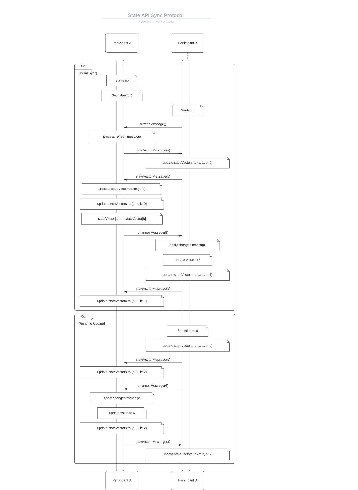

# spark-state Internals

Spark-state uses [Yjs](https://github.com/yjs/yjs) to manage states across effect participants. Yjs is a [CRDT implementation](https://github.com/yjs/yjs#Yjs-CRDT-Algorithm) that provides basic shared types like `Map` or `Array` with super powers: changes are automatically distributed to other peers and merged without merge conflicts.

Yjs is network agnostic (p2p!) which means spark-state needs to build its own network protocol to propogate changes over [Multipeer API](https://sparkar.facebook.com/ar-studio/learn/documentation/reference/classes/multipeermodule). This doc explains the syncing protocols in case you want to understand how spark-state works and possibly make a contribution.

## Terminology

* **State Vector** - In spark-state, each node would maintain a map of {peerId: stateVector} to keep track of all peers' latest states. So Yjs can just exchange only the differences when syncing two clients. Internally state vector use lamport timestamps to identify structs and to track in which order a client created them. The data structure is similar to the [version vectors](https://en.wikipedia.org/wiki/Version_vector) data structure. But we use state vectors only to describe the state of the local document, so we can compute the missing struct of the remote client. We do not use it to track causality.
* **Multipeer API** - Multipeer API is a Spark Native API which allows same effects on each local device to exchange messages in a real time data channel. It allows creators to create a topic and do pubsub as a message bus.
* **Participants API** - Participant API is another Spark Native API which allow effects to track all participants in a video call session and be notified whenever some participant join or leave the effects.

## Sync Protocol Walkthrough

Let's say we have participant A in the effect and participant B joins at the start up.

1. On starts up B will send a refresh message to ask existing participants to send their state vectors.
1. At the same time B will send its own initial state vector to update existing participants.
1. When A receives B's refresh request, it will send its state vector to B.
1. When A receives B's state vector update, it will update its local state vectors map for B.
1. If A has some local value, then A's state vector would be different from B's state vector. That will cause A to send a changesMessage to B.
1. When B receives changesMessage, B will update its local value and its own state vector then send its latest state vector back to A.
1. A finally receives B's state vector and update its state vectors map for B.

After A and B are synced, the real time update would go smoothly too.
1. Let's say B update the value after initial sync. Then B will update its local state vector and send it to A. At the same time, it will send a changesMessage to A to update its value.
1. When A receives B's state vector, it will update its local state vector map for B.
1. When A receives B's changes, it will apply the changes and update its local value.
1. Finally A will recalculate its state vector, update its local map for itself and send it to B.

## Periodically Sync

Multipeer API is by default a lossy data channel. That means message could be lost in the network level and they would not be recovered. Even though yjs can guarantee the eventual consistency even if some messages are dropped. But message lost could still cause end users to see stale data without resync.

To minimize the stale data, spark-state runs a periodic resync for each node. Every two seconds, each node would broadcast its own state vector to all other peers, so other peers would reply back with changesMessage if the origin node is not up to date. This extra resync is not expected to take up much bandwidth since state vector is usually small (~50 bytes). But we could lower the resync frequency if this is proven to be an issue.
